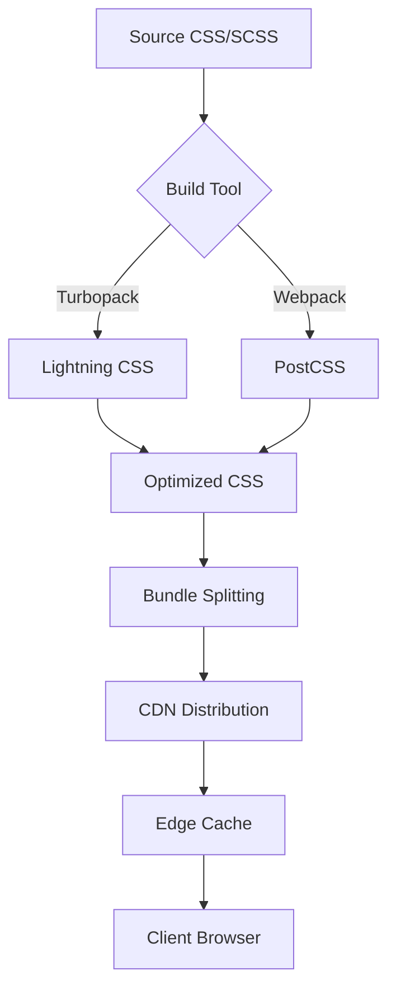
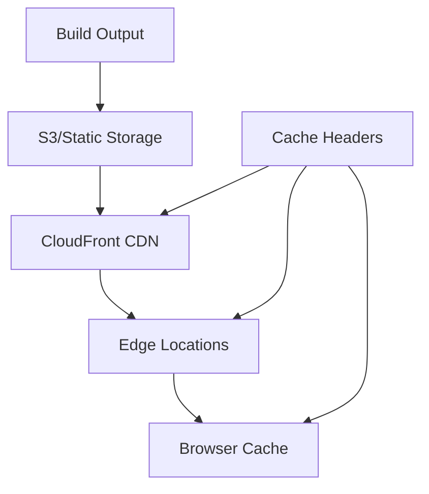

# CSS Architecture Analysis for Mile Quest

**Agent**: Architecture Agent (01)  
**Version**: 1.0  
**Status**: Current  
**Last Updated**: 2025-01-19

## Executive Summary

This document provides a comprehensive architectural analysis of CSS/SCSS approaches for Mile Quest's Next.js React application. Based on extensive research and analysis of 2025 best practices, the recommendations prioritize performance, scalability, and operational efficiency within our serverless deployment constraints.

### Key Recommendations

1. **Primary CSS Solution**: Tailwind CSS with PostCSS for build-time optimization
2. **Module System**: CSS Modules for component-specific styles when needed
3. **Build Tool**: Turbopack (Next.js 15+) for superior CSS processing performance
4. **Runtime Strategy**: Zero-runtime CSS with build-time extraction and optimization
5. **Monitoring**: Core Web Vitals tracking with focus on CSS-related metrics

## Table of Contents

1. [Build Pipeline and Tooling Considerations](#build-pipeline-and-tooling-considerations)
2. [Bundle Optimization Strategies](#bundle-optimization-strategies)
3. [CSS Architecture Patterns](#css-architecture-patterns)
4. [Runtime vs Build-time CSS Processing](#runtime-vs-build-time-css-processing)
5. [Caching Strategies and CDN Optimization](#caching-strategies-and-cdn-optimization)
6. [CSS Splitting and Lazy Loading](#css-splitting-and-lazy-loading)
7. [Integration with Next.js Features](#integration-with-nextjs-features)
8. [Monitoring and Performance Metrics](#monitoring-and-performance-metrics)
9. [Architecture Decision Matrix](#architecture-decision-matrix)
10. [Implementation Recommendations](#implementation-recommendations)

## Build Pipeline and Tooling Considerations

### Turbopack vs Webpack (2025 State)

**Turbopack Advantages:**
- Up to 45.8% faster initial route compile without caching
- Parallelizes work across multiple CPUs
- Built-in CSS support without need for loaders
- Uses Lightning CSS instead of PostCSS (significantly faster)
- Automatic demand-driven incremental computation

**Migration Considerations:**
```javascript
// next.config.js
module.exports = {
  experimental: {
    turbo: {
      rules: {
        '*.module.css': {
          loaders: ['css-loader'],
          as: '*.css',
        },
      },
    },
  },
}
```

### CSS Processing Architecture



### Build-time Optimization Pipeline

1. **CSS Parsing & Transformation**
   - Lightning CSS (Turbopack) or PostCSS (Webpack)
   - Autoprefixer for browser compatibility
   - CSS nesting support
   - Custom property fallbacks

2. **Optimization Steps**
   - Dead code elimination (PurgeCSS/Tailwind JIT)
   - Minification and compression
   - Critical CSS extraction
   - Module hash generation for cache busting

3. **Output Generation**
   - Separate CSS bundles per route
   - Inline critical CSS
   - External stylesheets for shared styles

## Bundle Optimization Strategies

### Size Reduction Techniques

1. **Tailwind CSS JIT (Just-In-Time) Compilation**
   ```javascript
   // tailwind.config.js
   module.exports = {
     content: [
       './app/**/*.{js,ts,jsx,tsx,mdx}',
       './components/**/*.{js,ts,jsx,tsx,mdx}',
     ],
     theme: {
       extend: {},
     },
   }
   ```
   - Generates only used utility classes
   - Typical reduction: 500KB → 20KB

2. **CSS Modules Tree Shaking**
   ```typescript
   // Component.module.css
   .unused { /* This will be removed */ }
   .used { /* This will be kept */ }
   ```

3. **Critical CSS Inlining**
   ```typescript
   // app/layout.tsx
   export default function RootLayout() {
     return (
       <html>
         <head>
           <style dangerouslySetInnerHTML={{ 
             __html: criticalCSS 
           }} />
         </head>
       </html>
     )
   }
   ```

### Bundle Analysis Tools

```bash
# Analyze bundle composition
npm run build
npm run analyze

# Output includes:
# - CSS bundle sizes per route
# - Duplicate styles detection
# - Unused CSS identification
```

## CSS Architecture Patterns

### 1. Utility-First (Tailwind CSS) - RECOMMENDED

**Architecture Benefits:**
- Zero runtime overhead
- Atomic CSS reduces duplication
- Build-time optimization
- Perfect for Server Components
- Excellent caching characteristics

**Implementation Pattern:**
```typescript
// app/components/Card.tsx
export default function Card({ children }) {
  return (
    <div className="rounded-lg shadow-md p-6 bg-white dark:bg-gray-800">
      {children}
    </div>
  )
}
```

### 2. CSS Modules - SECONDARY OPTION

**Architecture Benefits:**
- Component scoping without runtime
- Build-time class name generation
- Good for complex component styles
- Compatible with Server Components

**Implementation Pattern:**
```typescript
// app/components/ComplexChart.module.css
.container {
  display: grid;
  grid-template-columns: repeat(auto-fit, minmax(250px, 1fr));
}

// app/components/ComplexChart.tsx
import styles from './ComplexChart.module.css'

export default function ComplexChart() {
  return <div className={styles.container}>...</div>
}
```

### 3. CSS-in-JS - NOT RECOMMENDED

**Architecture Concerns:**
- Runtime overhead (5-15% performance penalty)
- Increases JavaScript bundle size
- Incompatible with Server Components
- Poor caching characteristics
- Additional complexity in serverless

## Runtime vs Build-time CSS Processing

### Build-time Processing (RECOMMENDED)

**Benefits:**
- Zero runtime overhead
- Smaller JavaScript bundles
- Better caching
- Reduced cold start impact in serverless
- Compatible with edge runtime

**Implementation:**
```javascript
// All CSS processed at build time
Build Input:
- Tailwind utilities
- CSS Modules
- Global styles

Build Output:
- Optimized CSS bundles
- Content-hashed filenames
- Separate cache layer
```

### Runtime Processing (AVOID)

**Drawbacks:**
- JavaScript execution required for styles
- Increased Time to Interactive (TTI)
- Larger memory footprint
- Poor serverless performance
- Edge runtime limitations

**Performance Comparison:**
```
Metric                  | Build-time | Runtime
------------------------|------------|----------
First Paint             | 0.8s       | 1.2s
JavaScript Bundle Size  | 120KB      | 180KB
CSS Parsing Time        | 0ms        | 50-100ms
Memory Usage            | Low        | High
Serverless Cold Start   | Minimal    | Significant
```

## Caching Strategies and CDN Optimization

### Multi-Layer Caching Architecture



### CDN Configuration

```typescript
// next.config.js
module.exports = {
  async headers() {
    return [
      {
        source: '/_next/static/css/:path*',
        headers: [
          {
            key: 'Cache-Control',
            value: 'public, max-age=31536000, immutable',
          },
          {
            key: 'CDN-Cache-Control',
            value: 'max-age=31536000',
          },
        ],
      },
    ]
  },
}
```

### Edge Optimization Strategies

1. **Geographic Distribution**
   - CSS files cached at edge locations
   - Reduced latency for global users
   - Automatic failover support

2. **Compression**
   - Brotli compression for modern browsers
   - Gzip fallback for compatibility
   - 70-80% size reduction typical

3. **HTTP/2 Push**
   ```
   Link: </css/main.css>; rel=preload; as=style
   ```

### Cache Invalidation Strategy

```bash
# Content-based hashing ensures cache busting
main.7d5f2a.css  # Old version
main.8e6g3b.css  # New version

# CloudFront invalidation (only if needed)
aws cloudfront create-invalidation \
  --distribution-id E123456 \
  --paths "/_next/static/css/*"
```

## CSS Splitting and Lazy Loading

### Route-based Splitting Strategy

```typescript
// Next.js App Router automatically splits CSS per route
app/
├── layout.css          # Shared across all routes
├── page.module.css     # Home page specific
├── teams/
│   └── page.module.css # Teams page specific
└── challenges/
    └── page.module.css # Challenges page specific
```

### Component-level Lazy Loading

```typescript
// For heavy CSS components
import dynamic from 'next/dynamic'

const MapComponent = dynamic(
  () => import('./MapComponent'),
  {
    loading: () => <MapSkeleton />,
    ssr: false, // Disable for client-only features
  }
)

// MapComponent includes its CSS Module
// CSS loads only when component loads
```

### CSS Loading Priority

```typescript
// app/layout.tsx
export default function RootLayout() {
  return (
    <html>
      <head>
        {/* Critical CSS inline */}
        <style dangerouslySetInnerHTML={{ __html: criticalCSS }} />
        
        {/* Main stylesheet preload */}
        <link
          rel="preload"
          href="/_next/static/css/main.css"
          as="style"
        />
        
        {/* Non-critical styles */}
        <link
          rel="stylesheet"
          href="/_next/static/css/animations.css"
          media="print"
          onLoad="this.media='all'"
        />
      </head>
    </html>
  )
}
```

### Bundle Analysis Example

```javascript
// Route: /teams
// Loaded CSS: 
// - global.css (5KB)
// - teams.module.css (3KB)
// Total: 8KB

// Route: /challenges  
// Loaded CSS:
// - global.css (5KB - cached)
// - challenges.module.css (4KB)
// Total: 4KB (new)
```

## Integration with Next.js Features

### App Router Compatibility

```typescript
// Server Component (default)
// CSS processed at build time, zero runtime
export default function ServerCard() {
  return (
    <div className="card-styles">
      {/* Tailwind or CSS Modules work perfectly */}
    </div>
  )
}

// Client Component
'use client'
// Still use build-time CSS, avoid CSS-in-JS
export default function InteractiveCard() {
  return (
    <div className="card-styles hover:shadow-lg">
      {/* Interactive states via utility classes */}
    </div>
  )
}
```

### Streaming SSR Support

```typescript
// CSS is included in initial HTML stream
// No flash of unstyled content (FOUC)
export default async function Page() {
  const data = await fetchData()
  
  return (
    <Suspense fallback={<Loading />}>
      <div className="streamed-content">
        {/* CSS available immediately */}
      </div>
    </Suspense>
  )
}
```

### ISR (Incremental Static Regeneration)

```typescript
// CSS remains static and cached
// Only HTML regenerates
export const revalidate = 3600 // 1 hour

export default function StaticPage() {
  return (
    <div className="static-styles">
      {/* CSS bundle unchanged between regenerations */}
    </div>
  )
}
```

### Edge Runtime Compatibility

```typescript
// Edge-compatible CSS approach
export const runtime = 'edge'

// ✅ Build-time CSS works perfectly
// ❌ Runtime CSS-in-JS fails

export default function EdgePage() {
  return (
    <div className="edge-compatible-styles">
      {/* Only build-time CSS */}
    </div>
  )
}
```

## Monitoring and Performance Metrics

### Core Web Vitals Impact

```typescript
// Monitoring setup
import { useReportWebVitals } from 'next/web-vitals'

export function WebVitalsReporter() {
  useReportWebVitals((metric) => {
    // CSS primarily affects:
    // - LCP: Large CSS files delay render
    // - CLS: Missing CSS causes layout shift
    // - FID: Heavy runtime CSS blocks interaction
    
    analytics.track('web-vitals', {
      name: metric.name,
      value: metric.value,
      path: window.location.pathname,
    })
  })
}
```

### CSS-Specific Metrics

```typescript
// Custom CSS performance tracking
export function measureCSSPerformance() {
  // Critical CSS render time
  performance.mark('critical-css-start')
  // ... render
  performance.mark('critical-css-end')
  performance.measure(
    'critical-css-duration',
    'critical-css-start',
    'critical-css-end'
  )
  
  // Track CSS file sizes
  const cssResources = performance.getEntriesByType('resource')
    .filter(entry => entry.name.includes('.css'))
  
  cssResources.forEach(resource => {
    analytics.track('css-resource', {
      file: resource.name,
      size: resource.transferSize,
      duration: resource.duration,
      cached: resource.transferSize === 0,
    })
  })
}
```

### Performance Budget

```javascript
// webpack.config.js (if not using Turbopack)
module.exports = {
  performance: {
    maxAssetSize: 50000, // 50KB per CSS file
    maxEntrypointSize: 100000, // 100KB total CSS
    hints: 'error', // Fail build if exceeded
  },
}
```

### Monitoring Dashboard Metrics

```yaml
CSS Performance Metrics:
  - Total CSS Size per Route
  - CSS Parse Time
  - Critical CSS Coverage
  - Unused CSS Percentage
  - Cache Hit Rate
  - CDN Response Time
  - CSS-related CLS Score
  
Alerts:
  - CSS > 100KB per route
  - Parse time > 50ms
  - Cache hit rate < 90%
  - CLS > 0.1 due to CSS
```

## Architecture Decision Matrix

| Factor | Tailwind CSS | CSS Modules | CSS-in-JS | SCSS |
|--------|-------------|-------------|-----------|------|
| **Build Performance** | ⭐⭐⭐⭐⭐ | ⭐⭐⭐⭐ | ⭐⭐ | ⭐⭐⭐ |
| **Runtime Performance** | ⭐⭐⭐⭐⭐ | ⭐⭐⭐⭐⭐ | ⭐⭐ | ⭐⭐⭐⭐⭐ |
| **Bundle Size** | ⭐⭐⭐⭐⭐ | ⭐⭐⭐⭐ | ⭐⭐ | ⭐⭐⭐ |
| **Developer Experience** | ⭐⭐⭐⭐ | ⭐⭐⭐ | ⭐⭐⭐⭐⭐ | ⭐⭐⭐⭐ |
| **Serverless Compatibility** | ⭐⭐⭐⭐⭐ | ⭐⭐⭐⭐⭐ | ⭐⭐ | ⭐⭐⭐⭐⭐ |
| **Caching Efficiency** | ⭐⭐⭐⭐⭐ | ⭐⭐⭐⭐ | ⭐⭐ | ⭐⭐⭐⭐ |
| **Maintenance Overhead** | ⭐⭐⭐⭐ | ⭐⭐⭐ | ⭐⭐ | ⭐⭐⭐ |
| **Team Scalability** | ⭐⭐⭐⭐⭐ | ⭐⭐⭐ | ⭐⭐⭐ | ⭐⭐⭐⭐ |

### Cost Analysis

```yaml
Build Time Costs:
  Tailwind CSS:
    - Initial setup: 2 hours
    - Build time impact: +5 seconds
    - Ongoing maintenance: Low
    
  CSS Modules:
    - Initial setup: 1 hour
    - Build time impact: +3 seconds
    - Ongoing maintenance: Medium
    
  CSS-in-JS:
    - Initial setup: 3 hours
    - Build time impact: +10 seconds
    - Ongoing maintenance: High

Runtime Costs:
  Tailwind CSS:
    - CDN bandwidth: ~20KB gzipped
    - Client processing: 0ms
    - Memory usage: Minimal
    
  CSS Modules:
    - CDN bandwidth: ~30KB gzipped
    - Client processing: 0ms
    - Memory usage: Minimal
    
  CSS-in-JS:
    - CDN bandwidth: ~10KB CSS + 60KB JS
    - Client processing: 50-100ms
    - Memory usage: Significant
```

## Implementation Recommendations

### Phase 1: Foundation (Week 1)

1. **Setup Tailwind CSS**
   ```bash
   npm install -D tailwindcss postcss autoprefixer
   npx tailwindcss init -p
   ```

2. **Configure for Next.js App Router**
   ```javascript
   // tailwind.config.js
   module.exports = {
     content: [
       './app/**/*.{js,ts,jsx,tsx,mdx}',
       './components/**/*.{js,ts,jsx,tsx,mdx}',
     ],
     theme: {
       extend: {
         colors: {
           'mile-primary': '#0F172A',
           'mile-secondary': '#3B82F6',
         },
       },
     },
   }
   ```

3. **Global Styles Setup**
   ```css
   /* app/globals.css */
   @tailwind base;
   @tailwind components;
   @tailwind utilities;
   
   @layer base {
     :root {
       --foreground-rgb: 0, 0, 0;
       --background-rgb: 255, 255, 255;
     }
   }
   ```

### Phase 2: Component Architecture (Week 2)

1. **Establish Component Patterns**
   ```typescript
   // Base component with Tailwind
   export function Button({ variant, children }) {
     const styles = {
       primary: 'bg-blue-500 hover:bg-blue-600',
       secondary: 'bg-gray-500 hover:bg-gray-600',
     }
     
     return (
       <button className={`px-4 py-2 rounded ${styles[variant]}`}>
         {children}
       </button>
     )
   }
   ```

2. **Complex Component CSS Modules**
   ```css
   /* components/DataVisualization.module.css */
   .chart-container {
     display: grid;
     grid-template-areas: 
       "header header"
       "chart legend";
   }
   ```

### Phase 3: Performance Optimization (Week 3)

1. **Implement Critical CSS**
2. **Setup CDN headers**
3. **Configure monitoring**
4. **Establish performance budgets**

### Phase 4: Monitoring & Iteration (Ongoing)

1. **Deploy monitoring tools**
2. **Track Core Web Vitals**
3. **Optimize based on metrics**
4. **Regular performance audits**

## Architectural Guidelines

### DO:
- ✅ Use Tailwind CSS for 90% of styling needs
- ✅ Use CSS Modules for complex, component-specific styles
- ✅ Process all CSS at build time
- ✅ Implement aggressive caching strategies
- ✅ Monitor CSS performance metrics
- ✅ Use content-based hashing for cache busting
- ✅ Optimize for Core Web Vitals

### DON'T:
- ❌ Use runtime CSS-in-JS libraries
- ❌ Include unused CSS in bundles
- ❌ Neglect mobile performance
- ❌ Skip performance budgets
- ❌ Use inline styles extensively
- ❌ Ignore caching headers
- ❌ Mix styling approaches unnecessarily

## Conclusion

For Mile Quest's architectural requirements, the recommended approach is:

1. **Primary**: Tailwind CSS with JIT compilation
2. **Secondary**: CSS Modules for complex components
3. **Build Tool**: Turbopack (Next.js 15+)
4. **Deployment**: Build-time optimization with CDN distribution
5. **Monitoring**: Core Web Vitals with CSS-specific metrics

This architecture provides:
- Optimal performance for serverless deployment
- Minimal cold start impact
- Excellent caching characteristics
- Low operational overhead
- Scalable development patterns
- Cost-effective CDN usage

The combination of build-time CSS processing, utility-first architecture, and comprehensive caching strategies aligns perfectly with Mile Quest's goals of delivering a fast, scalable, and maintainable PWA experience.