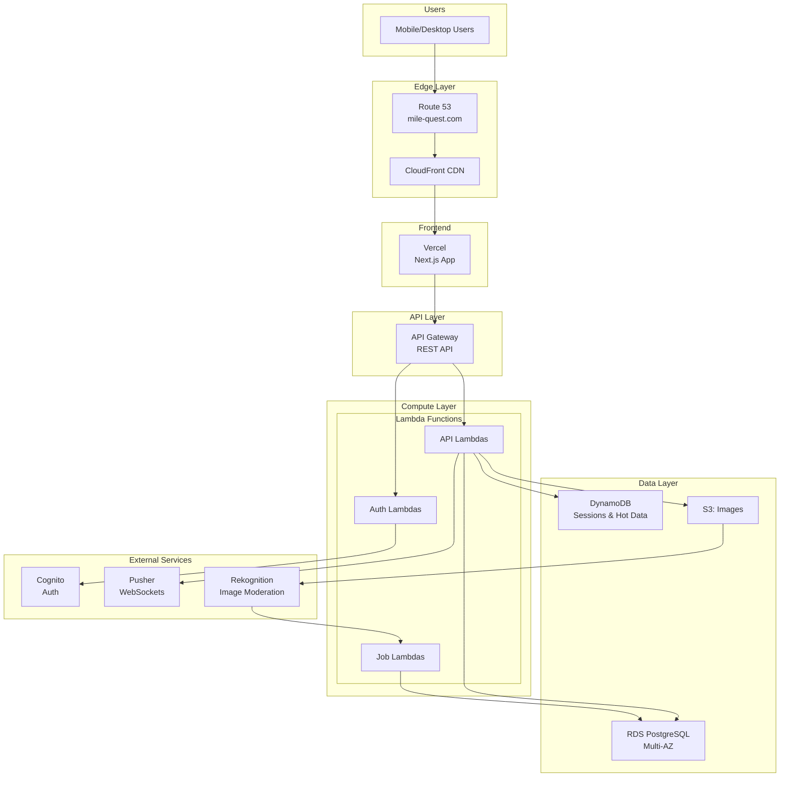
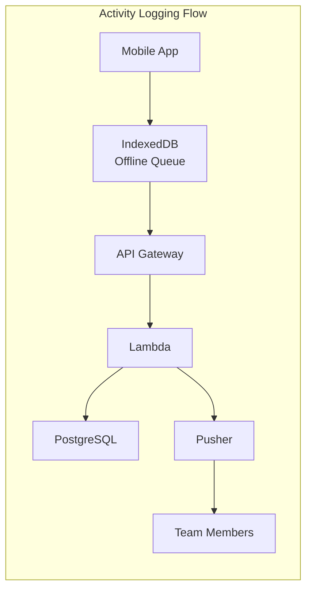
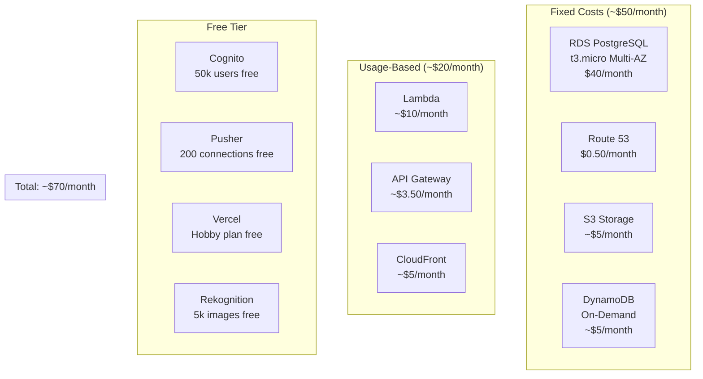
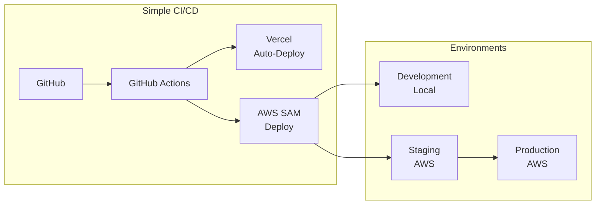
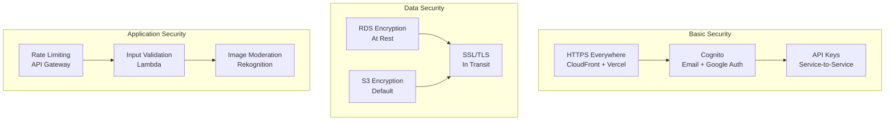
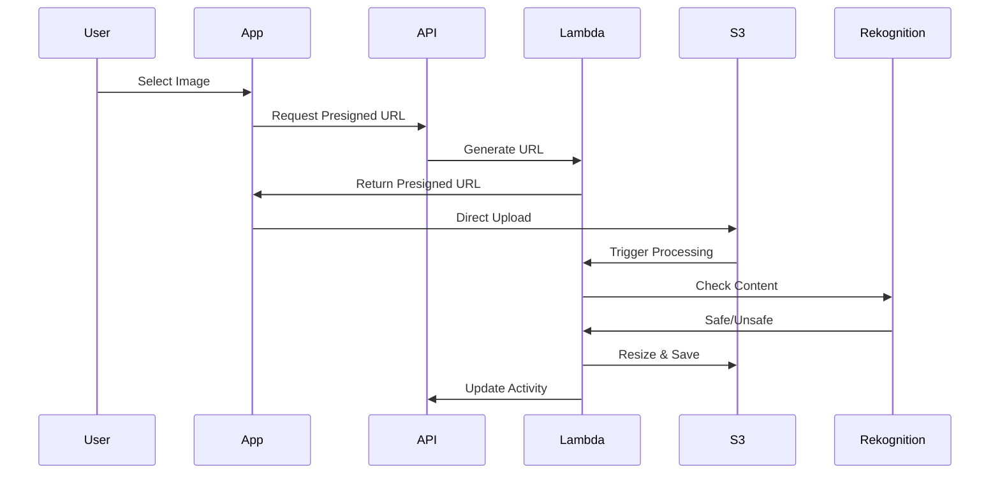
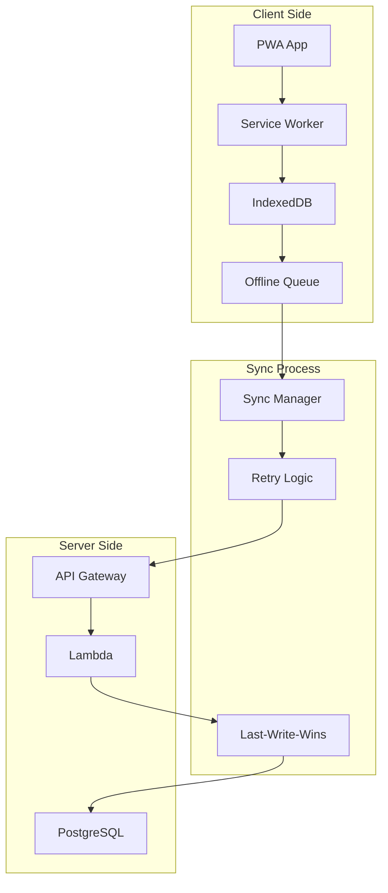
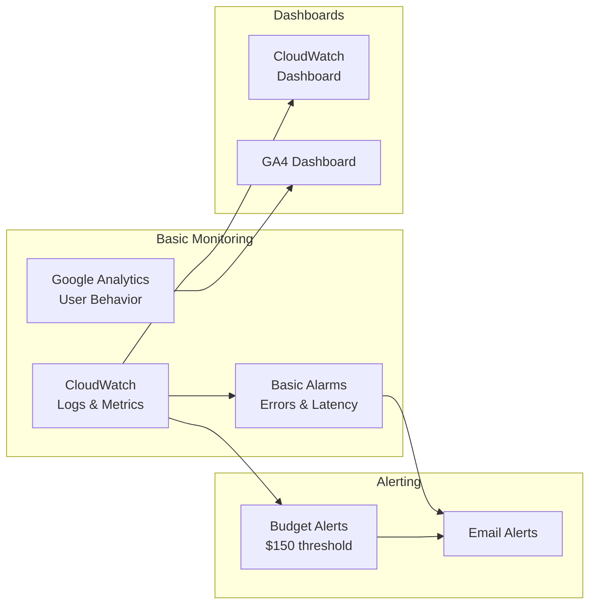
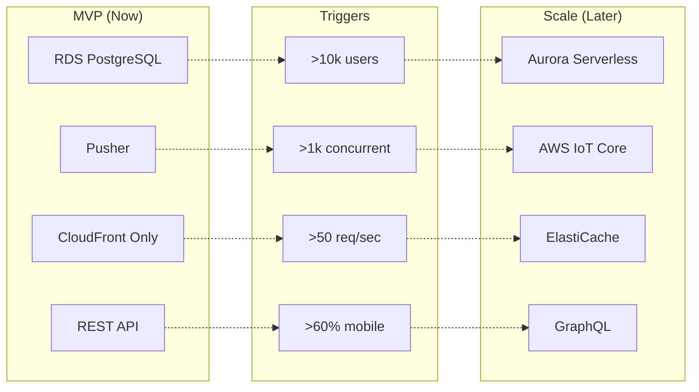

# Mile Quest MVP Infrastructure Diagrams (Simplified)

## High-Level Architecture (MVP)

## Simplified Data Flow

## MVP Cost Architecture

## Deployment Architecture (MVP)

## Security Architecture (MVP)

## Image Upload Flow (MVP)

## Offline Support Architecture (MVP)

## Monitoring Architecture (MVP)

## Migration Path Architecture

## Key Differences from Original

| Component | Original | MVP | Savings |
|-----------|----------|-----|---------|
| Database | Aurora Serverless v2 | RDS PostgreSQL | 60% |
| WebSocket | Custom Lambda + ALB | Pusher (managed) | 80% |
| Caching | ElastiCache + DynamoDB | CloudFront only | 100% |
| API | REST + GraphQL planned | REST only | Simpler |
| Monitoring | X-Ray + Full Stack | Basic CloudWatch | 90% |
| Security | WAF + Shield | Basic rate limiting | $100/mo |
| Frontend | S3 + CloudFront | Vercel | Faster deploys |

## Total MVP Infrastructure

- **Services Used**: 10 (vs 20+ in original)
- **Monthly Cost**: ~$70 (vs $250-600)
- **Setup Time**: 1 week (vs 3-4 weeks)
- **Maintenance**: Minimal (mostly managed services)

---

*This simplified architecture maintains all core functionality while dramatically reducing complexity and cost.*