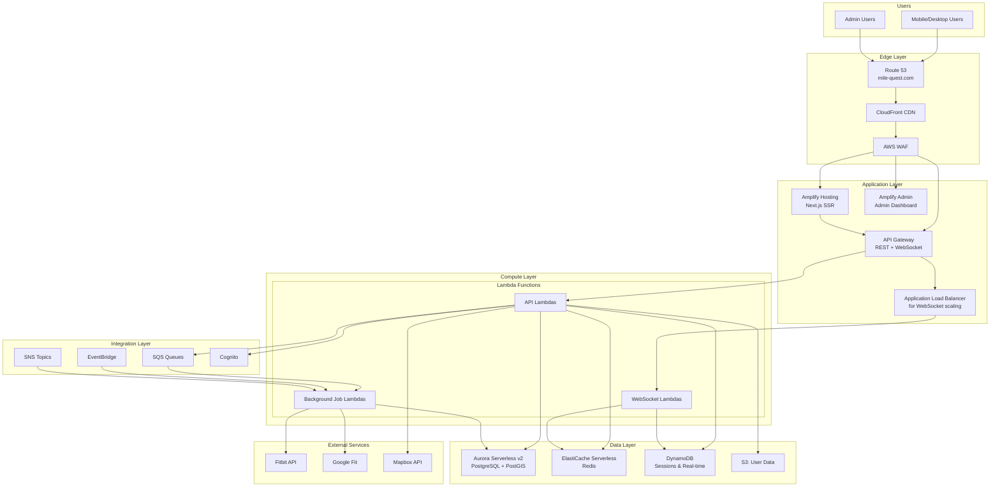
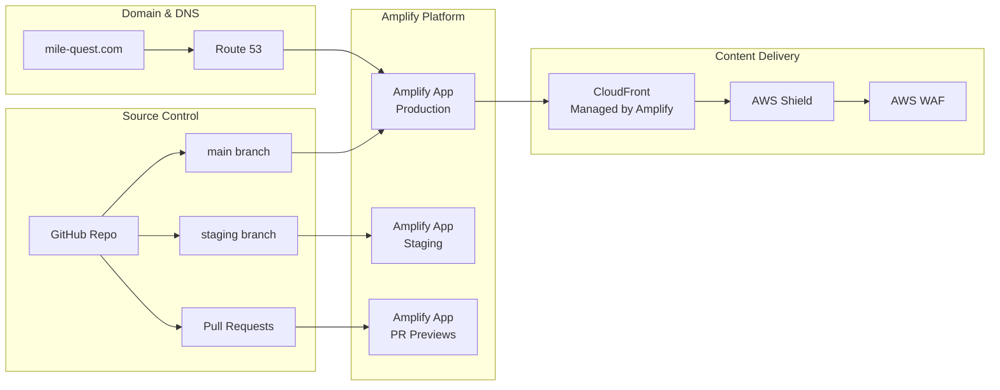
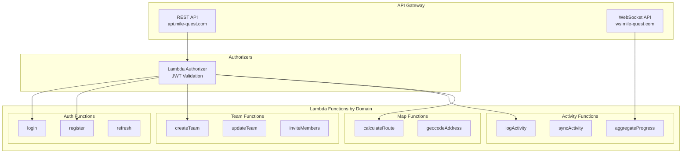
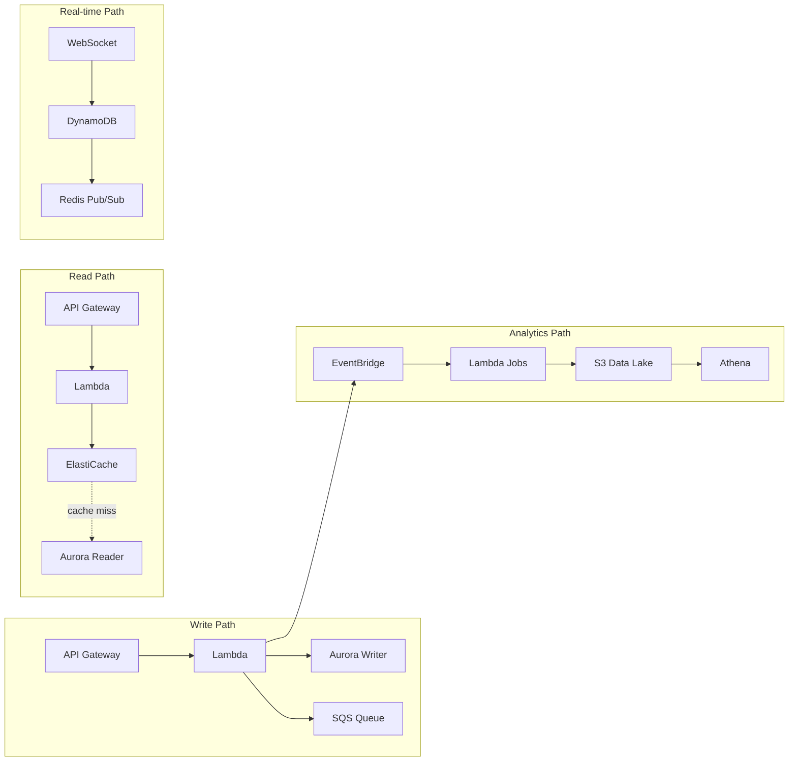
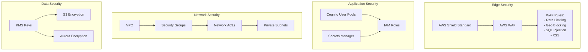
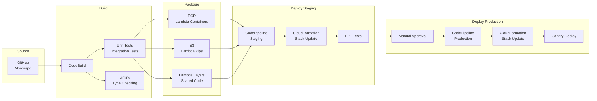
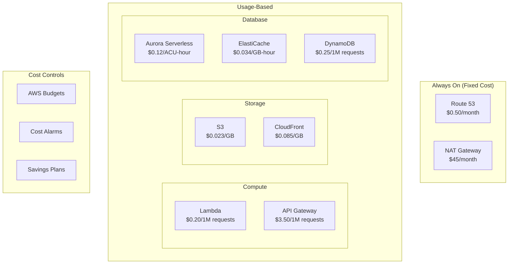
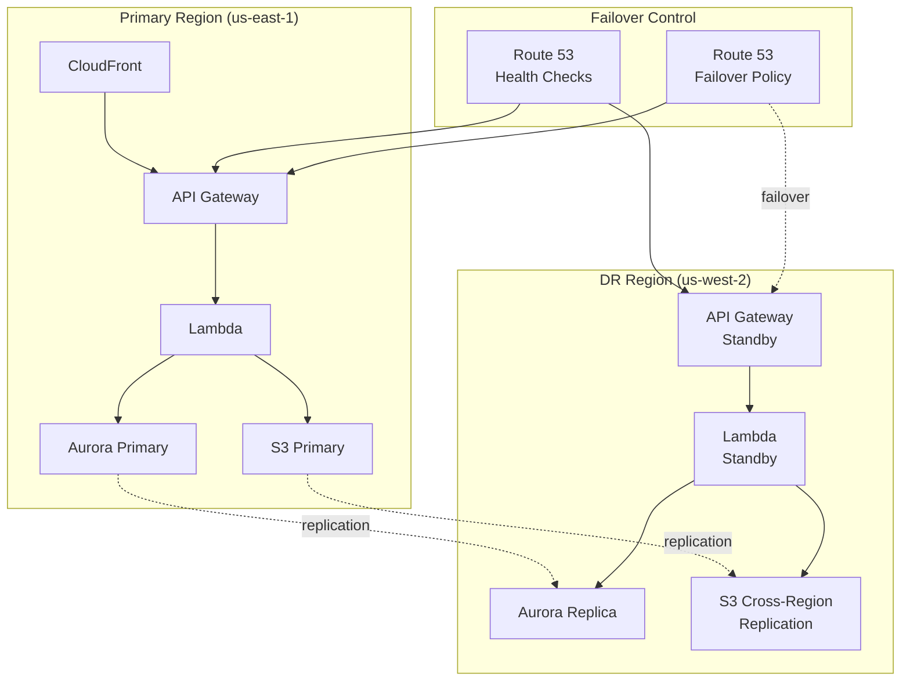
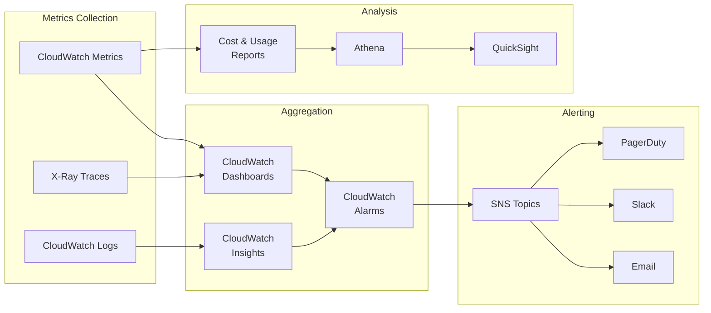

# AWS Infrastructure Architecture Diagrams

## High-Level Architecture

## Detailed Component Architecture

### Frontend Delivery Architecture

### API Architecture

### Data Flow Architecture

### Security Architecture

## Deployment Architecture

### CI/CD Pipeline

## Cost Optimization Architecture

### Resource Utilization

## Disaster Recovery Architecture

## Monitoring Architecture

