# Team Goal Creation - Interaction Flow

## User Journey Map

### Entry Points

1. **From Team Detail Page**
   - User views team they admin
   - Sees "Create Team Goal" button (admin only)
   - Taps button → Navigate to goal creation

2. **From Dashboard**
   - Quick action card for admins
   - "Set a goal for your team" prompt
   - Links to team selection if multiple teams

3. **From Empty State**
   - Team has no active goals
   - Prominent CTA: "Create your first goal"

## Detailed Interaction Flows

### Flow 1: Basic Goal Creation

```mermaid
graph TD
    A[Team Detail Page] --> B[Tap Create Goal]
    B --> C[Goal Creation Page]
    C --> D[Enter Goal Name]
    D --> E[Add First Waypoint]
    E --> F{Add Method?}
    F -->|Search| G[Type City Name]
    F -->|Map Click| H[Tap Location]
    G --> I[Select from Results]
    H --> J[Confirm Location]
    I --> K[Waypoint Added]
    J --> K
    K --> L{Add More?}
    L -->|Yes| E
    L -->|No| M[Review Route]
    M --> N[Set End Date]
    N --> O[Create Goal]
    O --> P[Success → Team Page]
```



### Flow 2: Advanced Route Building

```
1. Initial Setup
   └─ Enter basic info (name, description)
   
2. Route Building
   ├─ Add waypoints (minimum 2)
   ├─ Reorder by dragging
   ├─ Delete unwanted points
   └─ Toggle map/globe view
   
3. Route Optimization
   ├─ System calculates distance
   ├─ Shows daily requirement
   └─ Warns if unrealistic
   
4. Finalization
   ├─ Set end date
   ├─ Review summary
   └─ Create goal
```

### Flow 3: Search and Add Waypoint

**Step-by-step interaction:**

1. **Initiate Search**
   - Tap search bar
   - Keyboard slides up
   - Search icon changes to spinner

2. **Type Query**
   - User types "San Francisco"
   - Debounced search after 300ms
   - Results appear below

3. **View Results**
   ```
   ┌─────────────────────────────┐
   │ 🔍 San Francisco            │
   ├─────────────────────────────┤
   │ 📍 San Francisco, CA, USA   │
   │ 📍 San Francisco, Córdoba   │
   │ 📍 San Francisco Bay Area   │
   └─────────────────────────────┘
   ```

4. **Select Result**
   - Tap result
   - Map animates to location
   - Pin drops with number
   - Search bar clears

### Flow 4: Map Interaction

**Gesture Controls:**

| Gesture | Action | Feedback |
|---------|--------|----------|
| Tap | Add waypoint | Popup confirmation |
| Pinch | Zoom in/out | Smooth scaling |
| Pan | Move map | Momentum scroll |
| Long press | Context menu | Haptic feedback |
| Double tap | Quick zoom | Animate to 2x |

### Flow 5: Waypoint Management

```
Waypoint List State:
┌─────────────────────────────┐
│ 1 ≡ Seattle, WA        0 mi │ <- Start point
│ 2 ≡ Portland, OR     174 mi │ <- Draggable
│ 3 ≡ San Diego, CA    995 mi │ <- Delete button
└─────────────────────────────┘

Actions:
- Drag handle (≡) to reorder
- Tap (x) to delete
- Swipe left for delete option (iOS pattern)
```

## State Management

### Page States

1. **Empty State**
   - No waypoints added
   - Map centered on user location
   - Helper text visible

2. **Building State**
   - 1+ waypoints added
   - Route calculating indicator
   - Save button disabled

3. **Valid State**
   - 2+ waypoints added
   - Route calculated
   - All actions enabled

4. **Saving State**
   - Form disabled
   - Progress indicator
   - Prevent navigation

### Data Persistence

- **Auto-save Draft**: Every 30 seconds
- **Local Storage**: Waypoints, form data
- **Recovery**: On page reload
- **Clear**: On successful creation

## Error Handling

### Common Errors and Recovery

1. **Network Error**
   ```
   ┌─────────────────────────────┐
   │ ⚠️ Connection Lost          │
   │                             │
   │ Your changes are saved      │
   │ locally and will sync when  │
   │ you're back online.         │
   │                             │
   │ [Continue Offline] [Retry]  │
   └─────────────────────────────┘
   ```

2. **Invalid Route**
   ```
   ┌─────────────────────────────┐
   │ ❌ Can't Calculate Route    │
   │                             │
   │ No route found between      │
   │ these locations. Try        │
   │ different waypoints.        │
   │                             │
   │ [OK]                        │
   └─────────────────────────────┘
   ```

3. **Geocoding Failed**
   - Fallback to coordinate input
   - Manual location picker
   - Offline location cache

## Animation Specifications

### Micro-interactions

1. **Waypoint Addition**
   - Pin drops from top (bounce effect)
   - Ripple effect at location
   - Number fades in
   - Route line draws

2. **Waypoint Deletion**
   - Shrink and fade out
   - Route line redraws
   - List items slide up

3. **Route Calculation**
   - Dotted line animates
   - Progress from start to end
   - Distance counter increments

### Transitions

| Element | Duration | Easing |
|---------|----------|---------|
| Page entry | 300ms | ease-out |
| Map pan | 200ms | ease-in-out |
| Pin drop | 400ms | spring |
| Route draw | 600ms | ease-in |
| List reorder | 200ms | ease |

## Mobile-Specific Considerations

### Touch Optimization

- **Touch Targets**: Minimum 44x44px
- **Spacing**: 8px between interactive elements
- **Gestures**: Standard iOS/Android patterns
- **Feedback**: Haptic on key actions

### Landscape Mode

When device rotates:
1. Map expands to full screen
2. UI controls minimize
3. Floating action button for waypoints
4. Swipe up for details panel

### Performance

- **Lazy Loading**: Map tiles on demand
- **Throttling**: Route calculations
- **Caching**: Recent searches
- **Compression**: Map data

## Accessibility Flow

### Keyboard Navigation

```
Tab Order:
1. Back button
2. Goal name input
3. Description input
4. End date picker
5. Search bar
6. Map (arrow keys to pan)
7. Each waypoint (Enter to edit)
8. Add waypoint button
9. Action buttons
```

### Screen Reader Announcements

- "Goal creation page"
- "Enter goal name, required"
- "Waypoint added: Seattle, Washington"
- "Route calculated: 1,255 miles"
- "Warning: This distance requires 30 miles per day"

### Alternative Input

For users who can't use the map:
1. Text-based waypoint entry
2. Coordinate input option
3. List of popular routes
4. Voice input support

## Success Metrics

Track these interactions:
- Time to create first goal
- Number of waypoints per goal
- Use of search vs map click
- Error rate by type
- Abandonment points

---

*Created by UI/UX Design Agent*
*Version: 1.0*
*Date: 2025-01-20*