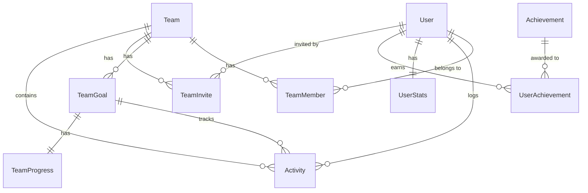

# Core Entities for Mile Quest

## Overview

This document defines the core entities (database tables) needed for Mile Quest based on the UI/UX requirements and architecture decisions.

## Entity List

### 1. User
Core user account information.

**Fields:**
- `id` (UUID) - Primary key
- `email` (String) - Unique, used for login
- `name` (String) - Display name
- `avatarUrl` (String?) - Profile picture URL
- `emailVerified` (Boolean) - Email verification status
- `cognitoId` (String) - AWS Cognito user ID
- `createdAt` (DateTime)
- `updatedAt` (DateTime)
- `deletedAt` (DateTime?) - Soft delete

**Indexes:**
- Unique on `email`
- Unique on `cognitoId`

### 2. Team
Walking challenge teams.

**Fields:**
- `id` (UUID) - Primary key
- `name` (String) - Team name (unique)
- `description` (String?)
- `avatarUrl` (String?) - Team picture
- `isPublic` (Boolean) - Whether team is discoverable
- `maxMembers` (Int) - Maximum team size (default 50)
- `createdById` (UUID) - User who created team
- `createdAt` (DateTime)
- `updatedAt` (DateTime)
- `deletedAt` (DateTime?) - Soft delete

**Indexes:**
- Unique on `name`
- Index on `isPublic`
- Index on `createdById`

### 3. TeamMember
Relationship between users and teams.

**Fields:**
- `id` (UUID) - Primary key
- `teamId` (UUID) - Foreign key to Team
- `userId` (UUID) - Foreign key to User
- `role` (Enum: ADMIN, MEMBER) - Member role
- `joinedAt` (DateTime)
- `leftAt` (DateTime?) - When user left team

**Indexes:**
- Unique composite on `teamId` + `userId` + `leftAt` (null)
- Index on `userId`
- Index on `teamId`

### 4. TeamGoal
Goals/challenges for teams with route information.

**Fields:**
- `id` (UUID) - Primary key
- `teamId` (UUID) - Foreign key to Team
- `name` (String) - Goal name
- `description` (String?)
- `targetDistance` (Float) - Total distance in miles
- `targetDate` (DateTime?) - Optional deadline
- `routeData` (JSON) - Waypoints and route information
- `status` (Enum: DRAFT, ACTIVE, COMPLETED, CANCELLED)
- `createdById` (UUID) - User who created goal
- `startedAt` (DateTime?)
- `completedAt` (DateTime?)
- `createdAt` (DateTime)
- `updatedAt` (DateTime)

**Indexes:**
- Index on `teamId`
- Index on `status`

**Route Data Structure:**
```json
{
  "waypoints": [
    {
      "id": "waypoint-1",
      "position": { "lat": 40.7128, "lng": -74.0060 },
      "address": "New York, NY",
      "order": 1
    }
  ],
  "segments": [
    {
      "startWaypointId": "waypoint-1",
      "endWaypointId": "waypoint-2",
      "distance": 215.5,
      "polyline": "encoded-polyline-string"
    }
  ],
  "totalDistance": 425.3
}
```

### 5. Activity
Individual walking/running activities logged by users.

**Fields:**
- `id` (UUID) - Primary key
- `userId` (UUID) - Foreign key to User
- `teamId` (UUID) - Foreign key to Team
- `teamGoalId` (UUID?) - Foreign key to TeamGoal
- `distance` (Float) - Distance in miles
- `duration` (Int) - Duration in seconds
- `startTime` (DateTime) - When activity started
- `endTime` (DateTime) - When activity ended
- `notes` (String?) - Optional activity notes
- `source` (Enum: MANUAL, STRAVA, APPLE_HEALTH, GOOGLE_FIT)
- `externalId` (String?) - ID from external source
- `createdAt` (DateTime)
- `updatedAt` (DateTime)

**Indexes:**
- Index on `userId`
- Index on `teamId`
- Index on `teamGoalId`
- Index on `startTime`
- Unique on `source` + `externalId` (for deduplication)

### 6. TeamProgress
Aggregated progress tracking for team goals.

**Fields:**
- `id` (UUID) - Primary key
- `teamGoalId` (UUID) - Foreign key to TeamGoal
- `totalDistance` (Float) - Sum of all activities
- `totalActivities` (Int) - Count of activities
- `totalDuration` (Int) - Sum of all durations
- `currentSegmentIndex` (Int) - Which route segment team is on
- `segmentProgress` (Float) - Distance into current segment
- `lastActivityAt` (DateTime?) - Most recent activity
- `updatedAt` (DateTime)

**Indexes:**
- Unique on `teamGoalId`

### 7. UserStats
Aggregated statistics per user.

**Fields:**
- `id` (UUID) - Primary key
- `userId` (UUID) - Foreign key to User
- `totalDistance` (Float) - All-time distance
- `totalActivities` (Int) - All-time activity count
- `totalDuration` (Int) - All-time duration
- `currentStreak` (Int) - Days in a row
- `longestStreak` (Int) - Best streak
- `lastActivityAt` (DateTime?)
- `updatedAt` (DateTime)

**Indexes:**
- Unique on `userId`

### 8. TeamInvite
Invitations to join teams.

**Fields:**
- `id` (UUID) - Primary key
- `teamId` (UUID) - Foreign key to Team
- `invitedByUserId` (UUID) - Foreign key to User
- `email` (String?) - Email for non-users
- `userId` (UUID?) - Foreign key to User if exists
- `code` (String) - Unique invite code
- `status` (Enum: PENDING, ACCEPTED, DECLINED, EXPIRED)
- `expiresAt` (DateTime)
- `createdAt` (DateTime)
- `acceptedAt` (DateTime?)

**Indexes:**
- Unique on `code`
- Index on `teamId`
- Index on `email`
- Index on `userId`
- Index on `status`

### 9. Achievement
Gamification achievements/badges.

**Fields:**
- `id` (UUID) - Primary key
- `key` (String) - Unique identifier (e.g., "first_mile")
- `name` (String) - Display name
- `description` (String)
- `iconUrl` (String)
- `category` (Enum: DISTANCE, STREAK, SPEED, TEAM, SPECIAL)
- `criteria` (JSON) - Rules for earning
- `points` (Int) - Points awarded
- `createdAt` (DateTime)

**Indexes:**
- Unique on `key`
- Index on `category`

### 10. UserAchievement
Achievements earned by users.

**Fields:**
- `id` (UUID) - Primary key
- `userId` (UUID) - Foreign key to User
- `achievementId` (UUID) - Foreign key to Achievement
- `earnedAt` (DateTime)
- `teamId` (UUID?) - Team context if applicable
- `activityId` (UUID?) - Activity that triggered it

**Indexes:**
- Unique composite on `userId` + `achievementId`
- Index on `userId`
- Index on `earnedAt`

## Relationships



## Data Integrity Rules

1. **User cannot join same team twice** (active membership)
2. **Team cannot exceed maxMembers**
3. **Activity distance must be positive and <= 1000 miles**
4. **Activity duration must be positive**
5. **Team names must be unique**
6. **At least one ADMIN per team**
7. **Cannot delete team with active members**
8. **Soft delete for audit trail**

## Performance Considerations

1. **Frequent Queries:**
   - User's teams and activities
   - Team leaderboards
   - Recent activities feed
   - Progress calculations

2. **Aggregation Strategy:**
   - Maintain UserStats and TeamProgress
   - Update via database triggers or application logic
   - Consider materialized views for complex queries

3. **Pagination:**
   - All list queries must support cursor-based pagination
   - Limit default page size to 20-50 items

## Next Steps

1. Convert to Prisma schema
2. Define computed fields
3. Add audit logging tables
4. Plan migration scripts
5. Performance testing queries