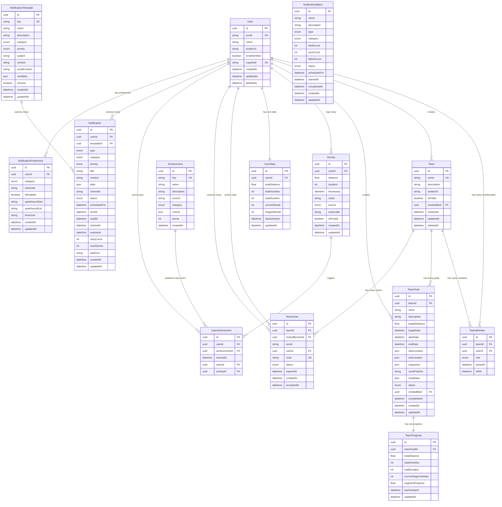

# Entity Relationship Diagram (ERD)

## Overview

This diagram shows the relationships between all database entities in Mile Quest, including the comprehensive notification system.

## Full ERD

## Key Changes in v1.2

### Removed Relationships
- **Activity → Team**: Activities no longer directly reference teams
- **Activity → TeamGoal**: Activities no longer directly reference goals
- Team association is now determined through the user's team membership at query time

### New Entities
1. **NotificationTemplate**: Reusable templates for consistent messaging
2. **Notification**: Individual notification instances with multi-channel support
3. **NotificationPreference**: User-specific notification settings by category
4. **NotificationBatch**: Batch processing for mass notifications

### Updated Fields
- **Distance Units**: All distance fields now in meters (was miles)
- **Activity.timestamp**: Single timestamp field (was startTime/endTime)
- **Activity.isPrivate**: Privacy flag for activity visibility
- **TeamGoal**: Added location and date fields for tracking periods

## Relationship Details

### Core Relationships

1. **User ↔ Team** (Many-to-Many via TeamMember)
   - Users can belong to multiple teams
   - Teams have multiple members
   - Relationship includes role (ADMIN/MEMBER)

2. **Team → TeamGoal** (One-to-Many)
   - Each team can have multiple goals
   - Goals belong to exactly one team

3. **User → Activity** (One-to-Many)
   - Activities are user-centric
   - No direct team association
   - Privacy controlled by isPrivate flag

4. **Progress Tracking**
   - TeamGoal has exactly one TeamProgress record
   - User has exactly one UserStats record
   - Both updated when activities are logged

5. **Notification System**
   - Users receive many notifications
   - Each notification optionally uses a template
   - Users set preferences per notification category
   - Batch processing for mass notifications

### Constraints and Rules

1. **Unique Constraints**
   - User: email, cognitoId
   - Team: name
   - TeamMember: (teamId, userId, leftAt)
   - Activity: (source, externalId)
   - TeamInvite: code
   - Achievement: key
   - UserAchievement: (userId, achievementId)
   - NotificationTemplate: key
   - NotificationPreference: (userId, category)

2. **Cascade Rules**
   - Soft delete for User and Team (set deletedAt)
   - TeamMember: Set leftAt instead of delete
   - Activity: Keep for historical data
   - Notifications: Cleanup based on expiresAt
   - Hard delete only for expired data

3. **Business Logic Constraints**
   - Team must have at least one ADMIN
   - User cannot join same team twice (while active)
   - Activity distance must be positive
   - Notifications respect user preferences
   - Private activities excluded from public feeds

## Query Optimization Notes

### Frequently Joined Tables
1. **User + TeamMember + Team** - For user's teams
2. **Activity + User** - For activity feeds (filtered by isPrivate)
3. **TeamGoal + TeamProgress** - For goal status
4. **User + UserStats** - For dashboards
5. **User + Notification + NotificationTemplate** - For notification feeds

### Denormalized Data
1. **TeamProgress** - Aggregates activity data (includes private activities)
2. **UserStats** - Aggregates user activity data
3. **NotificationBatch** - Tracks batch processing status

### Index Strategy
- Foreign keys automatically indexed
- Composite indexes for common query patterns
- Specialized notification queue indexes
- Privacy-aware activity indexes
- See `indexing-strategy.md` for detailed analysis

## Privacy Considerations

1. **Activity Privacy**
   - `isPrivate` flag controls visibility
   - Private activities excluded from public feeds
   - Private activities still count toward team goals
   - User stats respect privacy settings

2. **Notification Privacy**
   - Respects activity privacy in notifications
   - User preferences control delivery
   - Quiet hours supported per user

## Future Considerations

### Potential New Entities
1. **Comment** - Activity comments
2. **Like** - Activity likes/reactions
3. **Challenge** - Inter-team challenges
4. **Route** - Reusable route templates
5. **Webhook** - External integration events

### Scalability Preparations
1. **Sharding Strategy**
   - By user_id for user-specific data
   - By team_id for team-specific queries

2. **Archival Strategy**
   - Archive read notifications after 30 days
   - Move completed goals to archive tables
   - Archive activities older than 1 year

3. **Read Replica Usage**
   - Leaderboard queries
   - Analytics queries
   - Historical reports
   - Notification analytics

Last Updated: 2025-01-20 (v1.2)