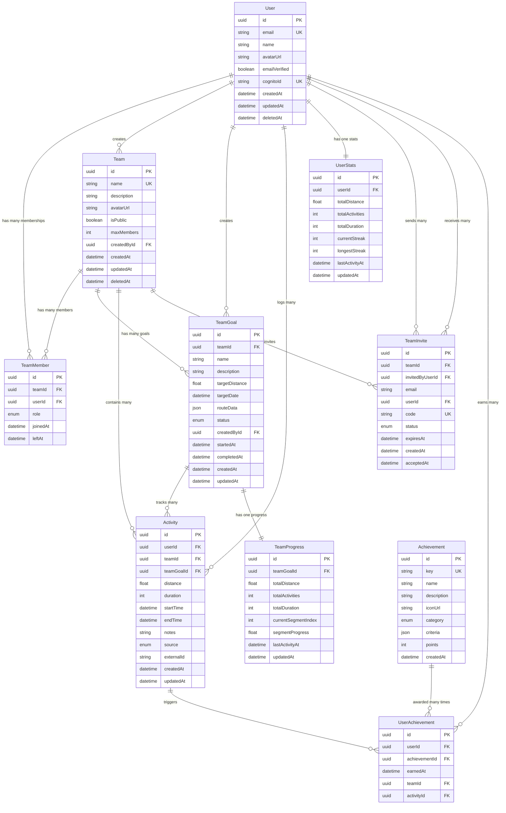

# Entity Relationship Diagram (ERD)

## Overview

This diagram shows the relationships between all database entities in Mile Quest.

## Full ERD

## Relationship Details

### Core Relationships

1. **User ↔ Team** (Many-to-Many via TeamMember)
   - Users can belong to multiple teams
   - Teams have multiple members
   - Relationship includes role (ADMIN/MEMBER)

2. **Team → TeamGoal** (One-to-Many)
   - Each team can have multiple goals
   - Goals belong to exactly one team

3. **Activity Relationships**
   - Each activity belongs to one user
   - Each activity belongs to one team
   - Activities optionally linked to a team goal

4. **Progress Tracking**
   - TeamGoal has exactly one TeamProgress record
   - User has exactly one UserStats record
   - Both updated when activities are logged

### Constraints and Rules

1. **Unique Constraints**
   - User: email, cognitoId
   - Team: name
   - TeamMember: (teamId, userId, leftAt=null)
   - Activity: (source, externalId)
   - TeamInvite: code
   - Achievement: key
   - UserAchievement: (userId, achievementId)

2. **Cascade Rules**
   - Soft delete for User and Team (set deletedAt)
   - TeamMember: Set leftAt instead of delete
   - Activity: Keep for historical data
   - Hard delete only for invites after expiration

3. **Business Logic Constraints**
   - Team must have at least one ADMIN
   - User cannot join same team twice (while active)
   - Activity distance: 0 < distance <= 1000
   - Team size cannot exceed maxMembers

## Query Optimization Notes

### Frequently Joined Tables
1. **User + TeamMember + Team** - For user's teams
2. **Activity + User** - For activity feeds
3. **TeamGoal + TeamProgress** - For goal status
4. **User + UserStats** - For dashboards

### Denormalized Data
1. **TeamProgress** - Aggregates activity data
2. **UserStats** - Aggregates user activity data
3. **Team member count** - Often queried, consider caching

### Index Strategy
- Foreign keys automatically indexed
- Additional composite indexes for common queries
- Partial indexes for soft-delete queries
- JSON GIN indexes for routeData searches

## Future Considerations

### Potential New Entities
1. **Notification** - User notifications
2. **Comment** - Activity comments
3. **Like** - Activity likes/reactions
4. **Challenge** - Inter-team challenges
5. **Route** - Reusable route templates

### Scalability Preparations
1. **Sharding Strategy**
   - By team_id for team-specific data
   - By user_id for user-specific data

2. **Archival Strategy**
   - Move completed goals to archive tables
   - Archive activities older than 1 year

3. **Read Replica Usage**
   - Leaderboard queries
   - Analytics queries
   - Historical reports