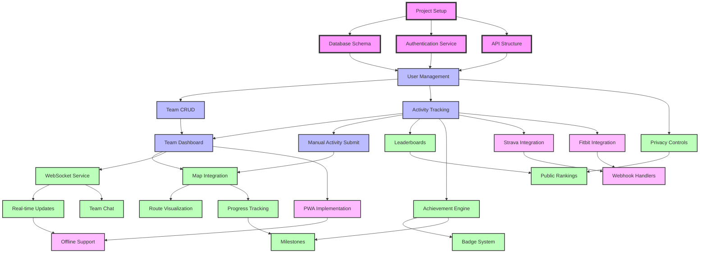

# Feature Dependencies Graph

## Overview

This document maps out the dependencies between features in Mile Quest, identifying blocking relationships, critical paths, and parallel development opportunities.

## Dependency Graph

## Critical Path Analysis

### Primary Critical Path
1. **Project Setup** → **Database Schema** → **User Management** → **Team CRUD** → **Team Dashboard**
   - This path blocks most other features
   - Estimated duration: 3 weeks
   - Must be completed before parallel work can begin

### Secondary Critical Paths

#### Authentication Path
1. **Project Setup** → **Authentication Service** → **User Management**
   - Blocks all user-related features
   - Can run parallel to database setup
   - Estimated duration: 1.5 weeks

#### Activity Tracking Path
1. **User Management** → **Activity Tracking** → **Manual Submit**
   - Core functionality requirement
   - Enables gamification and integrations
   - Estimated duration: 2 weeks

#### Map Integration Path
1. **Team Dashboard** → **Map Integration** → **Route Visualization**
   - Defines geographic experience
   - Can begin once dashboard exists
   - Estimated duration: 2 weeks

## Dependency Categories

### Hard Dependencies (Blocking)

#### Foundation Dependencies
- **Project Setup** blocks everything
- **Database Schema** blocks all data operations
- **Authentication Service** blocks all protected features
- **API Structure** blocks all endpoint development

#### Feature Dependencies
- **User Management** blocks team and activity features
- **Team CRUD** blocks team-specific features
- **Activity Tracking** blocks gamification and integrations
- **Map Integration** blocks geographic features

### Soft Dependencies (Recommended Order)

#### UI/UX Dependencies
- Complete **Design System** before component development
- Implement **Mobile Responsive** before PWA
- Create **Dashboard Layout** before feature components

#### Performance Dependencies
- Implement **Caching** before scaling features
- Add **Lazy Loading** before heavy components
- Setup **Monitoring** before production

## Parallel Development Opportunities

### Can Be Developed in Parallel

#### After User Management
- Team CRUD operations
- Activity tracking system
- Privacy controls
- Profile management

#### After Team Dashboard
- Map integration
- WebSocket service
- Achievement engine
- Analytics setup

#### Independent Development
- Design system components
- Email templates
- Documentation
- Testing infrastructure

## Risk Analysis

### High-Risk Dependencies

1. **External Service Integrations**
   - Risk: API changes or service outages
   - Mitigation: Abstract all external services
   - Fallback: Implement mock services

2. **Real-time Features**
   - Risk: WebSocket complexity
   - Mitigation: Start simple, iterate
   - Fallback: Polling mechanism

3. **Map Functionality**
   - Risk: Performance on mobile
   - Mitigation: Progressive enhancement
   - Fallback: Static map images

### Medium-Risk Dependencies

1. **Third-party Integrations**
   - Risk: OAuth approval delays
   - Mitigation: Apply early
   - Fallback: Manual import

2. **Gamification Logic**
   - Risk: Complex calculations
   - Mitigation: Thorough testing
   - Fallback: Simplified rules

## Implementation Recommendations

### Phase 1 Focus (Foundation)
1. Complete all foundation dependencies first
2. Establish service abstraction patterns
3. Set up testing infrastructure
4. Create basic UI components

### Phase 2 Focus (Core Features)
1. Implement user and team management
2. Build activity tracking system
3. Create basic dashboard
4. Add manual activity submission

### Phase 3 Focus (Enhancement)
1. Add map integration
2. Implement real-time features
3. Build gamification engine
4. Enable privacy controls

### Phase 4 Focus (Integration)
1. Add external integrations
2. Implement offline support
3. Optimize performance
4. Complete PWA features

## Dependency Resolution Strategy

### When Blocked
1. Identify the blocking dependency
2. Check if it can be mocked
3. Find parallel work if waiting
4. Escalate if critical path affected

### Reducing Dependencies
1. Use interface-driven development
2. Implement service abstractions
3. Create mock implementations
4. Design for loose coupling

## Feature Groupings

### Must Have Together
- User Management + Authentication
- Team CRUD + Team Dashboard
- Activity Tracking + Submission Form
- Map Integration + Route Visualization

### Can Be Deployed Separately
- Gamification features
- External integrations
- Chat functionality
- Advanced analytics

## Update Process

This dependency graph should be updated when:
- New features are added
- Dependencies change
- Risks are identified
- Implementation order changes

Regular reviews ensure accurate dependency tracking and help identify optimization opportunities.

---

Last Updated: 2025-01-15
Version: 1.0